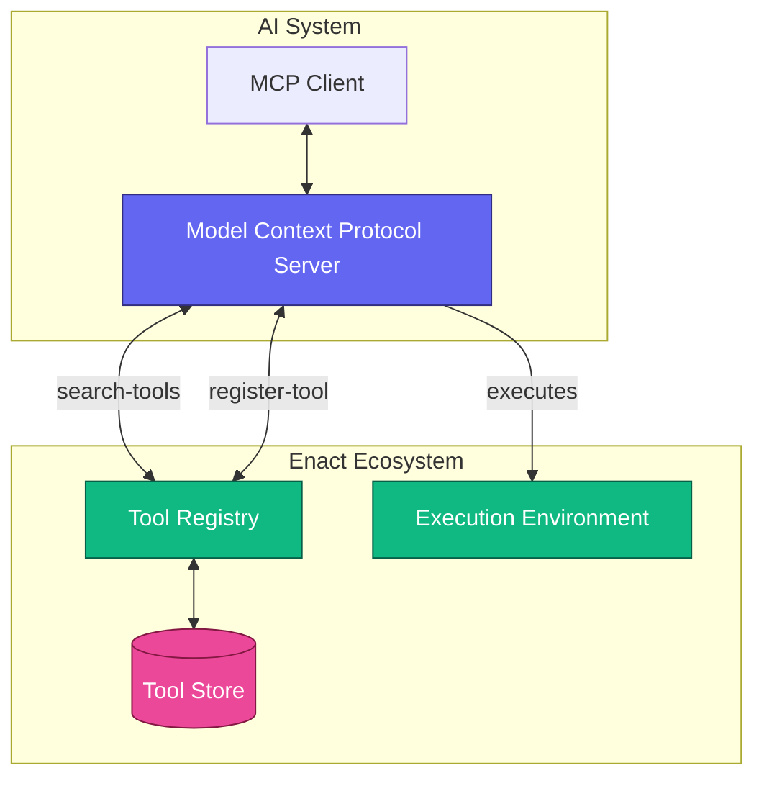
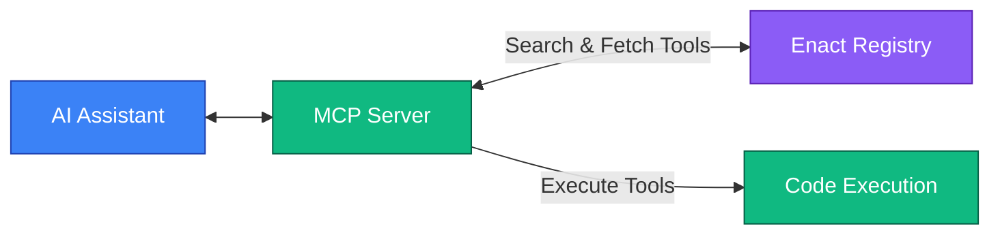

# Enact Protocol

  [](https://discord.gg/mMfxvMtHyS)

The **Enact Protocol** provides a standardized framework for defining and executing tasks that can be seamlessly integrated with the Model Context Protocol (MCP). It enables the creation of reusable, composable, and verifiable tools that can be dynamically discovered and executed by AI agents and other automated systems.

## Getting Started

This repository contains both the Registry Server and Client applications for the Enact Protocol. Follow these steps to set up and run the project.

### Prerequisites

- **Node.js** (v18+)
- **pnpm** (v8+)
- **Bun** (v1.0+) for the server

If you don't have these installed:

```bash
# Install Bun
curl -fsSL https://bun.sh/install | bash

# Install pnpm
npm install -g pnpm
```

### Installation

1. Clone the repository:

```bash
git clone https://github.com/your-username/enact-protocol.git
cd enact-protocol
```

2. Install dependencies:

```bash
pnpm install
```

3. Link packages:

```bash
# You can run the included script
./bun-link.sh

# Or manually link packages
cd packages/types
bun link
cd ../../apps/registry-server
bun link @enact/types
cd ../registry-client
bun link @enact/types
```

### Running the Development Environment

#### Start the Registry Server

```bash
cd apps/registry-server
bun run dev
```

The server will start on http://localhost:3000 by default.

#### Start the Registry Client (Web UI)

In a new terminal window:

```bash
cd apps/registry-client
pnpm dev
```

The client will be available at http://localhost:5173.

### Building for Production

#### Build the Registry Server

```bash
cd apps/registry-server
bun run build
```

This will create a production build in the `dist` directory.

#### Build the Registry Client

```bash
cd apps/registry-client
pnpm build
```

The built files will be available in the `dist` directory.

### Running in Production

#### Server

```bash
cd apps/registry-server
bun run dist/build.js
```

#### Client

You can serve the built client using any static file server, for example:

```bash
cd apps/registry-client
pnpm start
```

## Project Structure

```
├── apps
│   ├── registry-client    # React frontend for browsing and managing tools
│   └── registry-server    # Bun/Elysia backend for hosting the registry API
├── packages
│   ├── eslint-config      # Shared ESLint configurations
│   ├── types              # Shared TypeScript types
│   ├── typescript-config  # Shared TypeScript configurations
│   └── ui                 # Shared UI components
```

## Overview

At its simplest, an Enact tool is defined with a structured description in YAML:

```yaml
enact: 1.0.0
id: HelloWorld
description: A simple Hello World example
version: 1.0.0
type: python
run: |
  def main():
    print("Hello World")
    return {"message": "Hello World"}
```

Enact addresses a critical need in the AI ecosystem: as AI agents become more capable, they require reliable access to a diverse set of tools and capabilities. Enact provides a standardized protocol for defining, discovering, and executing tasks that AI agents can use at runtime. Think of it as a universal registry and execution environment for AI tools, perfectly complementing MCP's tool integration capabilities.

## Architecture

The Enact Protocol consists of several key components that work together with MCP:



## Core Concepts

### Tools

Enact tools are the basic building blocks of the Enact Protocol. Each **tool** is defined in YAML that follows the Enact Protocol Schema and can be seamlessly exposed as MCP tools.

**Required Fields:**
```yaml
enact: 1.0.0              # Protocol version
id: string                # Unique identifier
description: string       # What the tool does
version: 1.0.0            # Tool version

type: python|javascript|prompt|shell|workflow  # Execution environment
authors:                  # List of authors (optional)
  - name: string
    email: string         # Optional
inputs:                   # Input parameters (JSON Schema)
  type: object
  properties: {}          # JSON Schema properties
  required: []            # Required property names
run: string|array         # Implementation code or composite workflow
outputs:                  # Output parameters (JSON Schema)
  type: object
  properties: {}          # JSON Schema properties
  required: []            # Required property names
```

**Example: Temperature Converter Tool**

```yaml
enact: 1.0.0
id: TemperatureConverter
description: Converts temperature from Celsius to Fahrenheit
version: 1.0.0
type: python
authors:
  - name: John Smith
    email: john@example.com
inputs:
  type: object
  properties:
    celsius:
      type: number
      description: Temperature in Celsius
      minimum: -273.15
  required: ["celsius"]
run: |
  def main(celsius):
    fahrenheit = celsius * 9/5 + 32
    return {"fahrenheit": fahrenheit}
outputs:
  type: object
  properties:
    fahrenheit:
      type: number
      description: Temperature in Fahrenheit
  required: ["fahrenheit"]
```

### Types

Enact supports various execution environments specified directly in the `type` field:

- **`python`**: Execute Python code
- **`javascript`**: Execute JavaScript code
- **`shell`**: Execute shell commands
- **`prompt`**: Return a prompt template for LLMs
- **`workflow`**: Chain multiple tools together

### Parameter Management with JSON Schema

**Input Parameters with JSON Schema:**
```yaml
inputs:
  type: object
  properties:
    paramName:
      type: string        # Data type (string, number, boolean, object, array)
      description: string # Parameter description
      format: string      # Optional format specifier
      default: any        # Optional default value
      # Any other JSON Schema validation keywords
  required: ["param1", "param2"]  # Array of required parameter names
```

**Output Parameters with JSON Schema:**
```yaml
outputs:
  type: object
  properties:
    paramName:
      type: string        # Data type (string, number, boolean, object, array)
      description: string # Parameter description
      format: string      # Optional format specifier
  required: ["param1"]    # Array of required parameter names
```

Enact's parameter definitions are fully compliant with [JSON Schema](https://json-schema.org/overview/what-is-jsonschema), allowing for rich validation and documentation.

### Dependencies

Dependencies define the runtime requirements for executing a tool.

```yaml         
dependencies:
  packages:
    - pandas>=2.0.0     # Simple package and version specifier
    - numpy>=1.24.0
```

**Example with Dependencies:**

```yaml
enact: 1.0.0
id: DataAnalyzer
description: Analyzes numerical data and creates visualizations
version: 1.0.0
type: python
inputs:
  type: object
  properties:
    data:
      type: array
      description: Array of numerical values to analyze
      items:
        type: number
    options:
      type: object
      description: Configuration options for analysis
      properties:
        chart_type:
          type: string
          enum: ["bar", "line", "scatter"]
          default: "line"
  required: ["data"]
dependencies:
  packages:
    - pandas>=2.0.0
    - numpy>=1.24.0
    - matplotlib>=3.7.0
run: |
  import pandas as pd
  import numpy as np
  import matplotlib.pyplot as plt
  
  def main(data, options=None):
      # Implementation using pandas, numpy, and matplotlib...
      
outputs:
  type: object
  properties:
    analysis:
      type: object
      description: Statistical analysis results
    visualization:
      type: string
      format: binary
      description: Base64 encoded plot
  required: ["analysis"]
```

### Environment Variables

Environment variables define the configuration and secrets required for tool execution.

```yaml
env:
  vars:
    API_KEY:
      type: string
      description: "API key for the external service"
      source: "https://api.example.com/get-api-key"
    TIMEOUT:
      type: number
      description: "Request timeout in seconds"
      default: 30
  resources:
    memory: "512MB"  # Required memory allocation
    timeout: "60s"   # Maximum execution time
```

**Environment Variable Properties:**
- `type`: Data type of the environment variable
- `description`: Human-readable description of the variable's purpose
- `source`: Optional URL or instructions for obtaining the variable
- `default`: Optional default value if not provided

All environment variables are treated as secrets by default and should be stored securely.

#### Environment Variable Storage

Enact uses a simple approach for storing environment variables in a configuration file, with cross-platform compatibility in mind.

When a tool is executed, Enact will automatically load environment variables from this file and make them available to the tool. This provides a consistent location where tools can access their required environment variables.

##### Location

The configuration file is stored in a platform-specific default location:

- **Linux/macOS**: `~/.enact/config`
- **Windows**: `%USERPROFILE%\.enact\config`

### Error Handling

It is recommended to handle errors using the standard `outputs` structure:

```yaml
outputs:
  type: object
  properties:
    result:
      type: object
      description: The successful result of the operation
    error:
      type: object
      description: Error information (populated only when an error occurs)
      properties:
        message:
          type: string
          description: Human-readable error message
        code:
          type: string
          description: Machine-readable error code
        details:
          type: object
          description: Additional error details
  oneOf:
    - required: ["result"]
    - required: ["error"]
```

## Schema Validation

Tools can be validated against the Enact JSON Schema to ensure they conform to the protocol specification.

## Using with Model Context Protocol (MCP)

Enact tools can be dynamically discovered and executed through the Model Context Protocol, enabling AI agents to access the full range of tools in the Enact ecosystem.

### MCP Integration

The Enact Protocol works with MCP through two primary mechanisms:

1. **Dynamic Tool Discovery**: 
   - The `enact-search-capabilities` MCP tool allows searching the Enact registry for tools that match specific criteria
   - Found tools are automatically registered as MCP tools, making them immediately available for use

2. **Direct Tool Execution**:
   - The `execute-capability-by-id` MCP tool provides direct execution of any Enact tool using its ID
   - This allows for execution of tools that may not be pre-registered as MCP tools



## Troubleshooting

### Common Issues

1. **Package linking issues:**
   - If you encounter errors related to missing packages, ensure all workspace packages are properly linked.
   - Try running `./bun-link.sh` again or manually link packages.

2. **Port conflicts:**
   - If the server or client fails to start due to port conflicts, you can modify the port:
     - For the server: Edit the port in `apps/registry-server/src/server.ts`
     - For the client: Edit the port in `apps/registry-client/vite.config.ts`

3. **Database errors:**
   - If you encounter database errors, try deleting the `capabilities.db` file in the server directory and restart.

## Contributing

We welcome contributions to the Enact Protocol! You can start by making a PR or joining our [Discord](https://discord.gg/mMfxvMtHyS).

> "Perfection is achieved not when there is nothing more to add, but when there is nothing left to take away."
>
> — *Antoine de Saint-Exupéry*

## License

This project is licensed under the [MIT License](LICENSE).

---

© 2025 Enact Protocol Contributors